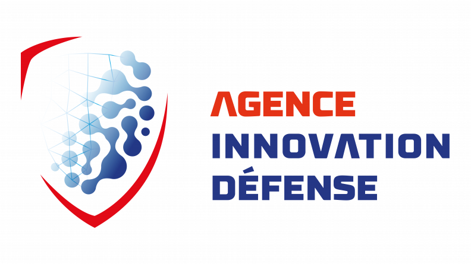
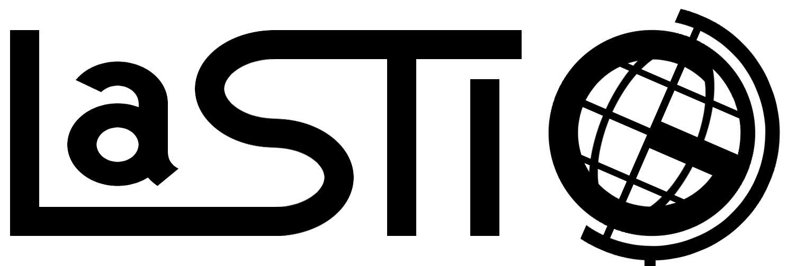
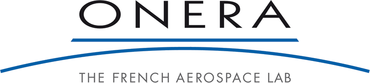
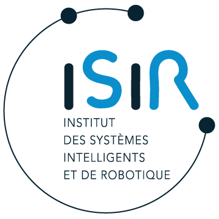

# 👹  OGRE: (E)arth Observation and Generative models for Rare Events detection

*(E)arth Observation and Generative models for Rare Events detection* (OGRE, ANR-25-ASTR-0012, 2026-2029) is a research project funded by the [Agence Nationale de la Recherche](https://anr.fr/) (ANR) under the ASTRID program with a grant from "Agence Innovation Défense" (AID).

OGRE explores generative models and their application to extreme events detection in multimodal remote sensing data (optical and SAR). It investigates how to leverage large generative models as likelihood estimators, to detect finely-localized anomalies, both in time and space, and to perform change detection in satellite image time series. It targets a broad range of applications from flood surveillance, ice melting monitoring and urban growth analysis.

## 📰 News

**March 2026**: Léo Demelle joins OGRE for his internship on flow matching models for unsupervised change detection.
**January 2026**: project OGRE starts!

### 📌 Open positions

* [Research engineer: large scale generative models for Earth observation](https://www.ign.fr/nous-rejoindre/offres-emploi/ingenieure-de-recherche-modeles-generatifs-profonds-pour-limagerie-satellitaire-cdd-12-mois-1590)

## ℹ About the project

### 🌍 Main research topics

The OGRE project investigates four main research directions. The first one is designing and training large generative models for *multispectral* and *SAR* imagery, going beyond the naive adaptation of RGB generative models to Earth Observation. The second one is investigating the conditioning of such models to various metadata, ranging from geographical locations to time of year and sensor characteristics. The third direction consists in creating anomaly detectors at the finest possible level, i.e. that are able to detect *localized* events such as building destruction and ice breaks. Finally, the last direction investigates change detection, in other words, finding *temporal* anomalies in satellite image time series.

### 👥 Consortium

The partners of the OGRE project are:

* [LASTIG laboratory](https://www.umr-lastig.fr/) (IGN/Univ. Eiffel/EIVP)
* [CEDRIC laboratory](https://cedric.cnam.fr/) (Cnam Paris)
* [DTIS](https://www.onera.fr/fr/dtis-unites-de-recherche) (ONERA)
* [ISIR laboratory](https://www.isir.upmc.fr/) (Sorbonne Université)

## 🏦 Funding

This project is funded through the ANR ASTRID program, under a grant from AID.

{:height="40px"}
{:height="40px"}
{:height="40px"}

{:height="40px"}
{:height="40px"}
{:height="40px"}
{:height="40px"}

