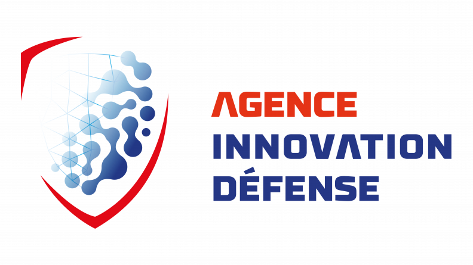
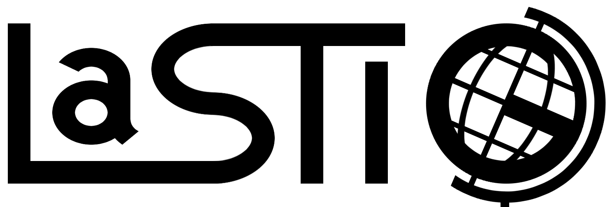
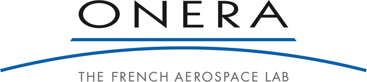
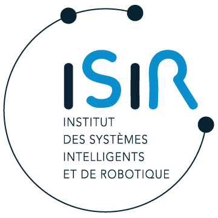

# 👹  OGRE: (E)arth Observation and Generative models for Rare Events detection

*(E)arth Observation and Generative models for Rare Events detection* (OGRE, [ANR-25-ASTR-0012](https://anr.fr/Project-ANR-25-ASTR-0012), 2026-2029) is a 3-years research project funded by the [Agence Nationale de la Recherche](https://anr.fr/) (ANR) under the ASTRID program with a grant from "Agence Innovation Défense" (AID).

OGRE explores the application of generative models to detect extreme events, such as natural disasters, in multimodal satellite image time series (optical and SAR). It investigates how to leverage diffusion models and flow matching as likelihood estimators in order to detect finely-localized anomalies, both in time and space, and to perform change detection. The project targets a broad range of downstream applications in Earth observation, such as flood surveillance, ice melting monitoring and urban growth analysis.

## 📰 News

* **March 2026**: Léo Demelle joins OGRE for his internship on flow matching models for unsupervised change detection.
* **January 2026**: project OGRE starts!

### 📌 Open positions

* ~~[Research engineer: large scale generative models for Earth observation](https://www.ign.fr/nous-rejoindre/offres-emploi/ingenieure-de-recherche-modeles-generatifs-profonds-pour-limagerie-satellitaire-cdd-12-mois-1590)~~ *(filled)*

## ℹ About the project

### 🌍 Main research topics

The OGRE project investigates four main research directions:

1. Designing and training large generative models for *multispectral* and *SAR* imagery. Our aim is to go beyond the naive adaptation of RGB generative models to Earth observation, and instead deliver models that are tailored to the spectral and spatial characteristics of remote sensing imagery.
2. Studying the impact of the conditioning of such models under various metadata, ranging from geographical locations to time of year and sensor characteristics. Not all extreme events are equal, and some are more unlikely to be observed in specific areas or seasons.
3. Creating anomaly detectors at the finest possible level, i.e. that are able to detect small events such as building destruction and ice breaks that cover only part of an image. Earth observation images cover large areas, but anomalies are often *localized*.
4. Extending these approaches to change detection. Change is a *temporal* anomaly in a satellite image time series, that is specific to its spatio-temporal context. Unsupervised change detection is the ultimate goal of OGRE.

### 👥 Consortium

The OGRE project is structured around four partners:

* [LASTIG laboratory](https://www.umr-lastig.fr/) (IGN/Univ. Eiffel/EIVP): coordinator,
* [CEDRIC laboratory](https://cedric.cnam.fr/) (Cnam Paris),
* [DTIS](https://www.onera.fr/fr/dtis-unites-de-recherche) (ONERA),
* [ISIR laboratory](https://www.isir.upmc.fr/) (Sorbonne Université).

## 🏦 Funding

This project is funded through the ANR ASTRID program, under a grant from AID.

{:height="40px"}
{:height="40px"}
{:height="40px"}

{:height="40px"}
{:height="40px"}
{:height="40px"}
{:height="40px"}

#### Credits

Monster by Roberto Chiaveri from <a href="https://thenounproject.com/browse/icons/term/monster/" target="_blank" title="Monster Icons">Noun Project</a> (CC BY 3.0)
Probability by Mas Kurin from <a href="https://thenounproject.com/icon/probability-6335051/">Noun Project</a> (CC BY 3.0)
Satellite by Corner Pixel from <a href="https://thenounproject.com/icon/satellite-8293338/">Noun Project</a> (CC BY 3.0)
Disaster by Eucalyp from <a href="https://thenounproject.com/browse/icons/term/disaster/" target="_blank" title="disaster Icons">Noun Project</a> (CC BY 3.0)
